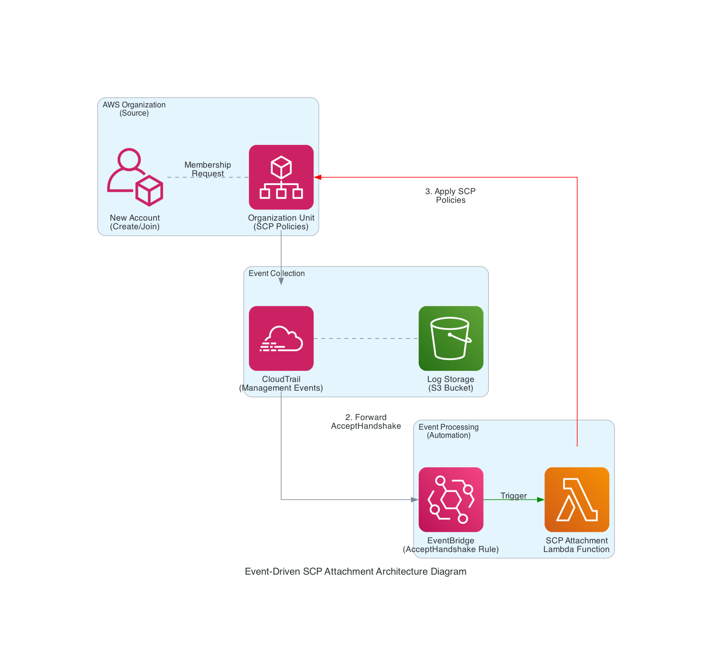

## Issue Statement

### Background/Context

When new accounts join through AWS Organizations, manual SCP attachment creates operational overhead and security risks. Current methods using root/OUs lack granular control and audit capabilities.

### Objectives

- Automate SCP application for new member accounts
- Eliminate root/OAOU-level dependencies
- Maintain full audit trail of policy attachments

### Constraints

- Must work across all AWS regions
- No modification to existing OU structures
- Solution must comply with SOC 2 requirements

## Proposed Solution

### Architecture Diagram



### Solution Summary

Real-time SCP enforcement using event-driven architecture:

1. CloudTrail captures `AcceptHandshake` API events
2. EventBridge triggers Lambda on pattern match
3. Lambda validates and attaches pre-defined SCPs
4. All actions logged in S3 for auditing

### Key Components & Technologies

| Component        | Purpose                  | Technology            |
| ---------------- | ------------------------ | --------------------- |
| Event Source     | Account join events      | AWS Organizations API |
| Event Capture    | Management event logging | CloudTrail + S3       |
| Event Processing | Rule matching & routing  | EventBridge           |
| Policy Engine    | SCP application logic    | Lambda (Node 22)      |
| Audit Trail      | Immutable logs           | S3 + Glacier          |

## Implementation Plan

### Resource Requirements

- Create Organization SCPs (Service control policies)

  - name `deny-cdn-purchase`

  ```json
  {
    "Version": "2012-10-17",
    "Statement": [
      {
        "Sid": "Statement1",
        "Effect": "Deny",
        "Action": ["cloudfront:CreateDistribution"],
        "Resource": ["*"]
      }
    ]
  }
  ```

  - get SCP id (Cloudshell or AWS Cli)

  ```bash
  aws organizations list-policies --filter SERVICE_CONTROL_POLICY

  # Example Outputs
  # {
  #  "Policies": [
  #      {
  #          "Id": "p-FullAWSAccess",
  #          "Arn": "arn:aws:organizations::aws:policy/service_control_policy/p-FullAWSAccess",
  #          "Name": "FullAWSAccess",
  #          "Description": "Allows access to every operation",
  #          "Type": "SERVICE_CONTROL_POLICY",
  #          "AwsManaged": true
  #      },
  #      {
  #          "Id": "p-xxxxxxx",
  #          "Arn": "arn:aws:organizations::123456789101:policy/o-vh8o4fkffz/service_control_policy/p-xxxxxxx",
  #          "Name": "deny-cdn-purchase",
  #          "Description": "deny cloudfront purchase",
  #          "Type": "SERVICE_CONTROL_POLICY",
  #          "AwsManaged": false
  #      },
  #      {
  #          "Id": "p-xxxxxxx",
  #          "Arn": "arn:aws:organizations::123456789101:policy/o-vh8o4fkffz/service_control_policy/p-xxxxxxx",
  #          "Name": "deny-leave",
  #          "Description": "deny leave org",
  #          "Type": "SERVICE_CONTROL_POLICY",
  #          "AwsManaged": false
  #      }
  #  ]
  #}
  ```

- Create S3 bucket and CloudTrail trail
  - S3 bucket
    - name `aws-cloudtrail-logs`
    - encryption is optional
  - CloudTrail trail
    - name `eventsTrail`
    - management event only
- Create Lambda function

  - name `MemeberAccountInitialization`
  - auto-generate function IAM role
  - language `nodejs 22`
  - architecture `x86 & arm`
  - configuration
    512MB
    15s timeout
  - deploy index.mjs

  ```node
  import {
    OrganizationsClient,
    AttachPolicyCommand,
    ListPoliciesCommand,
  } from "@aws-sdk/client-organizations";

  const organizationsClient = new OrganizationsClient();
  const scpIds = process.env.POLICY_IDS?.split(",");

  export const handler = async (event) => {
    const userIdentity = event.detail?.userIdentity;
    const accountId = userIdentity ? userIdentity.accountId : null;

    if (!accountId) {
      console.error("No  account ID found in the event.");
      return;
    }

    try {
      for (const scpId of scpIds) {
        const listPoliciesCommand = new ListPoliciesCommand({
          Filter: "SERVICE_CONTROL_POLICY",
        });
        const policiesResponse = await organizationsClient.send(
          listPoliciesCommand
        );
        const policyExists = policiesResponse.Policies.some(
          (policy) => policy.Id === scpId
        );

        if (!policyExists) {
          console.error(`SCP  with ID ${scpId} does not exist.`);
          continue;
        }

        const attachPolicyCommand = new AttachPolicyCommand({
          PolicyId: scpId.trim(),
          TargetId: accountId,
        });
        await organizationsClient.send(attachPolicyCommand);

        console.log(
          `SCP  ${scpId} successfully attached to account ${accountId}`
        );
      }
    } catch (error) {
      console.error("Error  attaching SCP:", error);
    }
  };
  ```

  - Create EventBridge rule `MemberAccountInitialization` (event-based)
    - Event pattern
    ```json
    {
      "source": ["aws.organizations"],
      "detail-type": ["AWS API Call via CloudTrail"],
      "detail": {
        "eventSource": ["organizations.amazonaws.com"],
        "eventName": ["AcceptHandshake"]
      }
    }
    ```

  ```
  - target
  Lambda function `MemeberAccountInitialization`
  ```

- Create IAM policy `OrganizationsLambdaOperations`, attach to IAM role `MemeberAccountInitialization-role-hnq4hlhj`

### Dependencies

1. Existing AWS Organization with enabled SCPs
2. Central CloudTrail trail configured
3. Target SCP policies pre-created

## 4. Security & Compliance

### Data Protection

- S3 bucket encryption (SSE-S3 + Bucket Policy)
- Lambda environment variables encrypted with KMS
- CloudTrail log integrity validation enabled

### Compliance Standards

- SOC 2: Automated evidence collection
- GDPR: Pseudonymization of account IDs
- ISO 27001: Audit trail retention (7 years)

### IAM Roles and Policies

#### IAM Roles

`MemeberAccountInitialization-role-hnq4hlhj`

- `AWSLambdaBasicExecutionRole-01883de4-8e6b-413f-81f2-9fadcb309f3c`

```json
{
  "Version": "2012-10-17",
  "Statement": [
    {
      "Effect": "Allow",
      "Action": "logs:CreateLogGroup",
      "Resource": "arn:aws:logs:us-east-1:339713133385:*"
    },
    {
      "Effect": "Allow",
      "Action": ["logs:CreateLogStream", "logs:PutLogEvents"],
      "Resource": [
        "arn:aws:logs:us-east-1:339713133385:log-group:/aws/lambda/MemeberAccountInitialization:*"
      ]
    }
  ]
}
```

- `OrganizationsLambdaOperations`

```json
{
  "Version": "2012-10-17",
  "Statement": [
    {
      "Effect": "Allow",
      "Action": [
        "organizations:AttachPolicy",
        "organizations:ListPolicies",
        "organizations:DescribePolicy",
        "organizations:ListRoots",
        "organizations:ListAccounts"
      ],
      "Resource": "*"
    }
  ]
}
```
